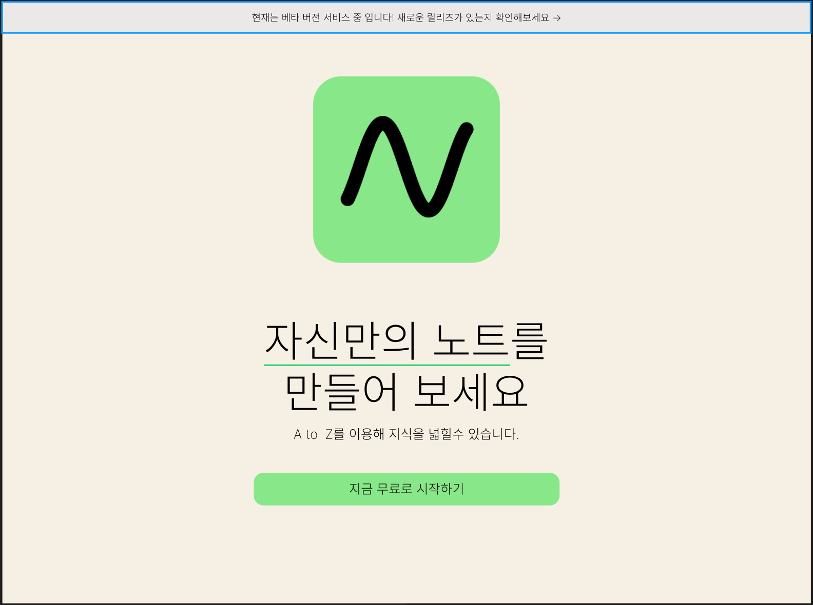
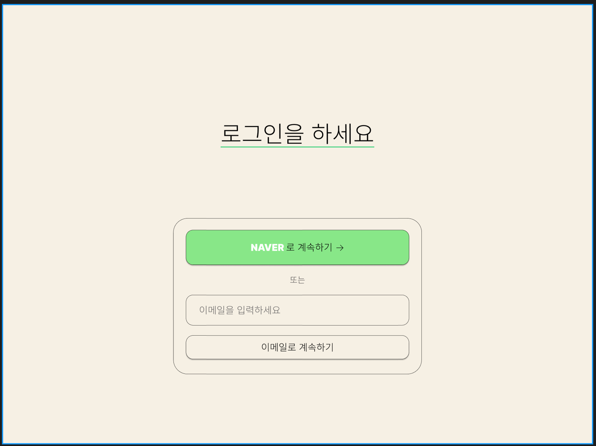
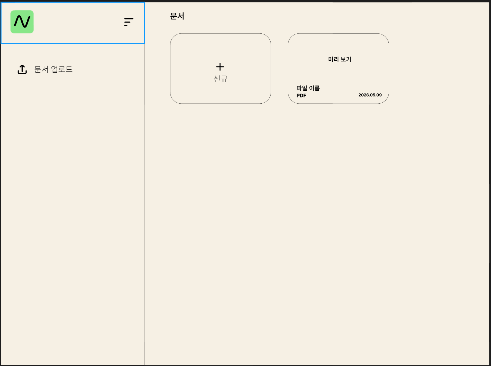
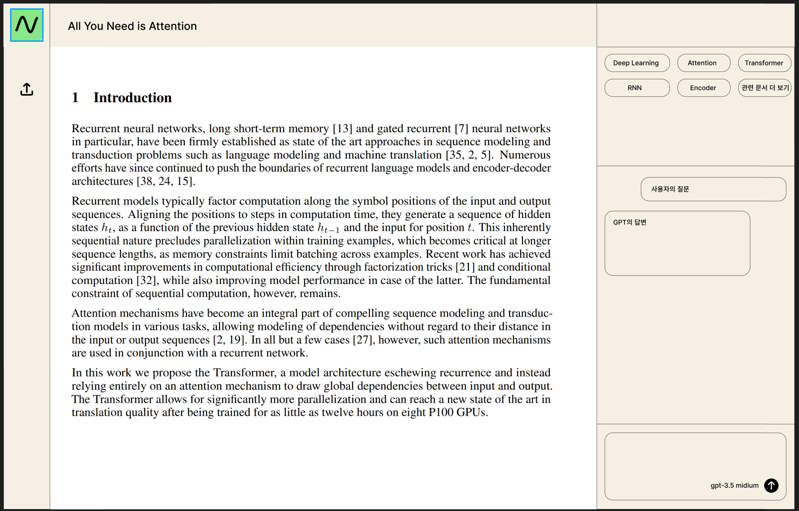
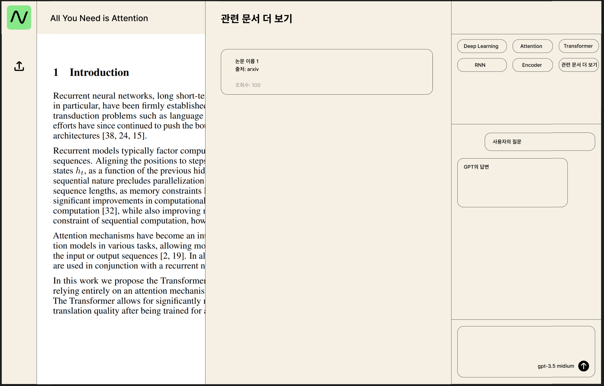

# MATCHUP Frontend

건양대학교 MATCH業 프로젝트 **문서 번역 학습 지원 서비스** 프론트엔드입니다.

현재 백엔드 문서 기준으로 연결하기 쉽게 다음 구조로 정리했습니다.

- Next.js App Router
- JWT Bearer Token 저장 및 자동 첨부
- Access Token 만료 시 Refresh Token으로 재발급 후 기존 요청 재시도
- Auth / Documents / Translation / Summary / Tags / Notes / Chat / Recommendation API 함수 분리
- 문서 업로드, 목록 조회, 상세 조회, 번역 생성, 요약 생성, AI 질문, 유사 문서 조회 UI 포함

## 실행 방법

```bash
npm install
cp .env.example .env.local
npm run dev
```

브라우저에서 아래 주소를 엽니다.

```text
http://localhost:3000
```

## 백엔드 실행 확인

백엔드 FastAPI 서버가 먼저 켜져 있어야 합니다.

```bash
cd matchup_backend
uvicorn app.main:app --reload
```

확인:

```text
http://127.0.0.1:8000/health
http://127.0.0.1:8000/docs
```

## 환경변수

`.env.local`

```env
NEXT_PUBLIC_API_BASE_URL=http://127.0.0.1:8000/api/v1
NEXT_PUBLIC_BACKEND_HEALTH_URL=http://127.0.0.1:8000/health
```

## 백엔드 연동 주의사항

현재 제공된 백엔드 API 문서의 번역 API는 문서 전체 번역입니다.

```text
POST /api/v1/documents/{document_id}/translation
```

요청값은 아래처럼 언어만 받습니다.

```json
{
  "source_language": "en",
  "target_language": "ko"
}
```

따라서 **밑줄 친 선택 영역만 번역**하려면 백엔드에 별도 엔드포인트가 필요합니다.

추천 추가 API:

```http
POST /api/v1/documents/{document_id}/translation/selected
```

```json
{
  "selected_text": "Attention mechanisms have become...",
  "source_language": "en",
  "target_language": "ko"
}
```

이 프론트엔드는 밑줄/선택 UI와 선택 텍스트 저장 구조를 만들어두었고, 현재는 백엔드 문서에 있는 **문서 단위 번역 API**와 연결되어 있습니다.

## 디자인 과정 (Design Process)

프로젝트의 UI/UX 설계를 위해 다음과 같은 디자인 과정을 거쳤습니다.

### 디자인 스크린샷
<p align="center">
  
  
  
  
  
</p>

- **와이어프레임 및 레이아웃 설계**: 대시보드, 문서 뷰어, 채팅 인터페이스의 배치 및 사용자 흐름 정의
- **프로토타이핑**: 실제 사용 사례를 기반으로 한 기능 동작 확인
- **주요 화면 설계**:
  - 로그인 및 회원가입 페이지
  - 문서 목록 대시보드
  - AI 뷰어 및 인터랙션 화면 (번역, 요약, 메모)
  - 문서 기반 AI 채팅 인터페이스

